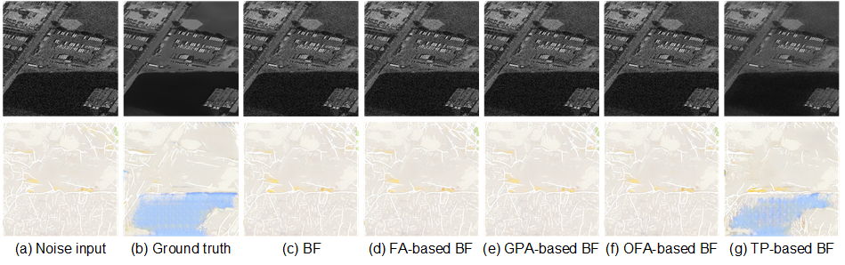
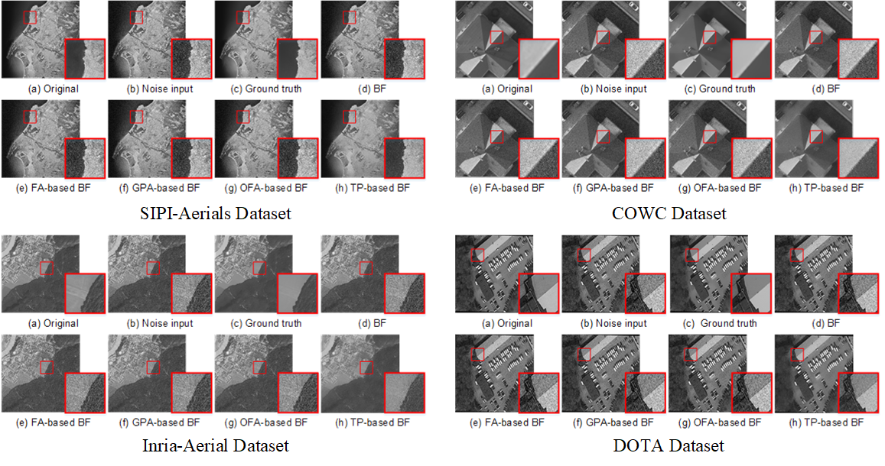

# Two-Pass Bilateral Smooth Filtering for Remote Sensing Imagery

[](https://creativecommons.org/licenses/by-nc-sa/4.0/)
[](https://hits.seeyoufarm.com)



## Introduction
This repository contains implementation of our GRSL paper titled as __Two-Pass Bilateral Smooth Filtering for Remote Sensing Imagery.__ In this paper, we propose a two-pass bilateral filter, TP-based BF, and an adaptive control scheme of range kernels for noise-invariant edge-preserving image smoothing. Experimental results on four aerial-imagery benchmark datasets show that our TP-based BF outperforms the existing bilateral filters in terms of both feature-aware and gradient-aware measures.

**Authors**: Bo-Hao Chen, Hsiang-Yin Cheng, Yi-Syuan Tseng, and Jia-Li Yin

**Paper**: [PDF](https://ieeexplore.ieee.org/document/9325516)

## Requirements
### Dataset
To build noise dataset, you'll also need:
* [SIPI-Aerials](http://sipi.usc.edu/database/database.php)
* [COWC](https://gdo152.llnl.gov/cowc/)
* [Inria-Aerial](https://project.inria.fr/aerialimagelabeling/)
* [DOTA](https://captain-whu.github.io/DOTA/dataset.html)

### Dependencies
* MATLAB R2019a

### It was tested and runs under the following OSs:
* Windows 10
* Ubuntu 16.04

Might work under others, but didn't get to test any other OSs just yet.

## Getting Started:
```bash
$ git clone https://github.com/bigmms/chen_grsl21_tpbf.git
$ cd chen_grsl21_tpbf
$ matlab
>> demo_GABF
```
The test results will be saved in: `./img_output/`

## Results


## License + Attribution
The TPBF code is licensed under [CC BY-NC-SA 4.0](https://creativecommons.org/licenses/by-nc-sa/4.0/). Commercial usage is not permitted. If you use this code in a scientific publication, please cite the following [paper](https://ieeexplore.ieee.org/document/9325516):
```
@ARTICLE{ChenGRSL2021,
  author={B. -H. {Chen} and H. -Y. {Cheng} and Y. -S. {Tseng} and J. -L. {Yin}},
  journal={IEEE Geoscience and Remote Sensing Letters}, 
  title={Two-Pass Bilateral Smooth Filtering for Remote Sensing Imagery}, 
  year={2021},
  volume={},
  number={},
  pages={1-5},
  doi={10.1109/LGRS.2020.3048488}}
```
